# DVWA - Bruteforce - Easy

## Set Up Burp Suite

Start a new temp project in Burp Suite.

We will be using Burp Suite Browser. 

1. Click on Proxy.
2. Under Proxy click Intercept.
3. Now click on Open Browser.
4. Enter the IP Address of the DVWA Virtual Machine.

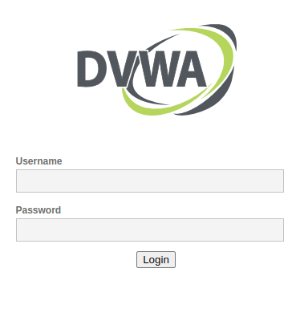

now you have this site.

## Login

Username: admin

Password: password

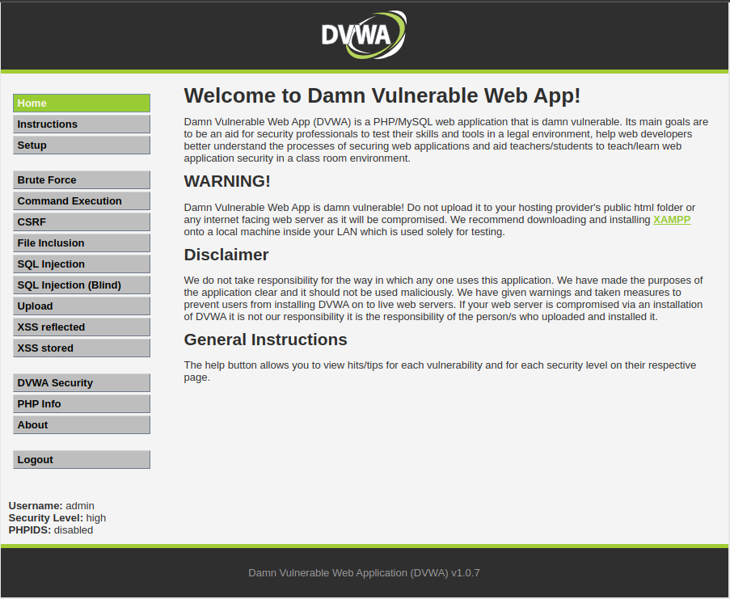

## Set up for this challenge

1. Go to DVWA Security.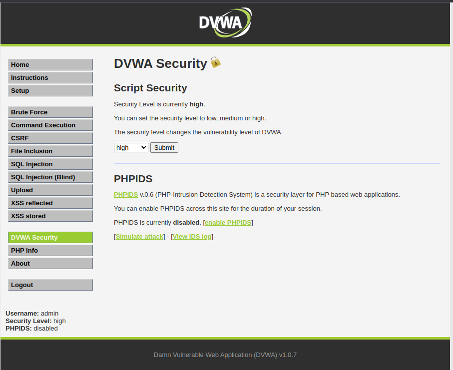
2. Now Select low in the drop down menu and submit. You get the following alert. 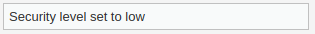
3. For confirmation on bottom left side you can check. 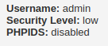
4. Now click on Brute Force.

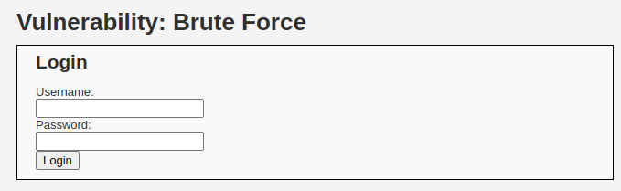

## Now Lets Start with the attack.

Now in burpsuite, click on ``Intercept is off`` to turn the intercept on.

Try entering the username ``admin`` and password ``pass`` and login.

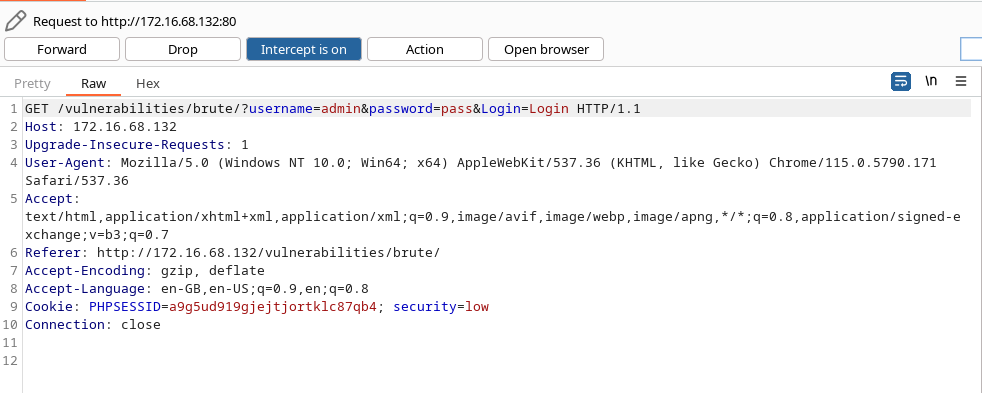

Now lets send this information to Intruder.

Click on Action then Send to Intruder or Press ``Ctrl + i``.

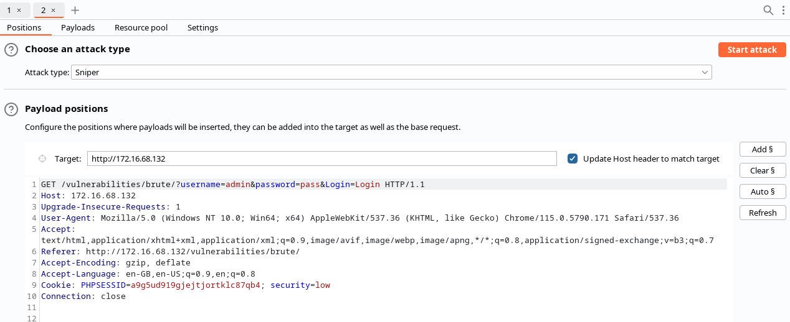

select pass and click on add.

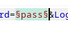

now we have set pass as the variable.

## Setting Up the Payload

Go to Intuder -> Payloads

In payload settings, lets load up this [file](https://github.com/danielmiessler/SecLists/blob/master/Passwords/xato-net-10-million-passwords.txt) from SecLists.

Click on load then goto the location of the file and select the file.

After Setup You get this

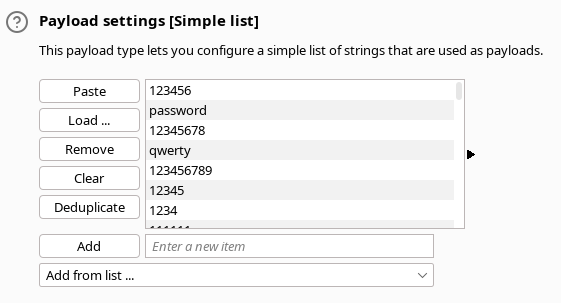

## Final Step

Go to Intruder -> Settings -> Grep Match

Clear all and add ``incorrect`` and ``Incorrect`` to the list.

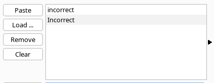

Now start the attack.

## Results

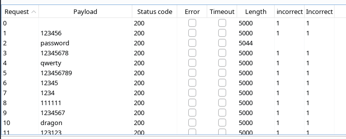

We can see changes in the row 2  in length and incorrect.

So we searched for incorrect passwords so all incorrect passwords are marked 1

the the password for admin user is ``password``.
