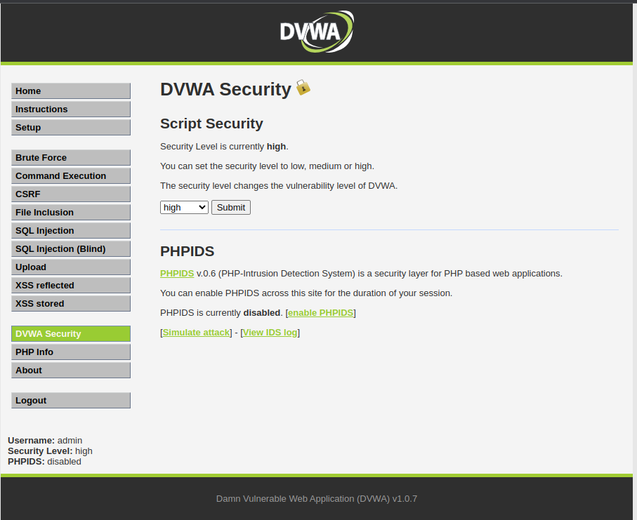
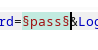
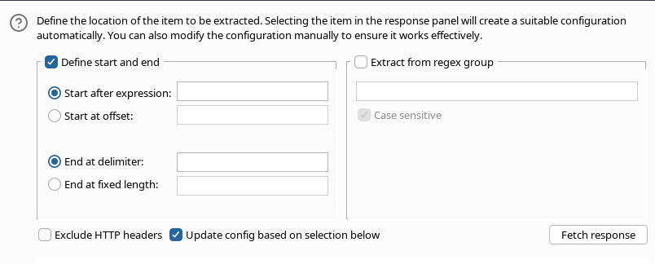
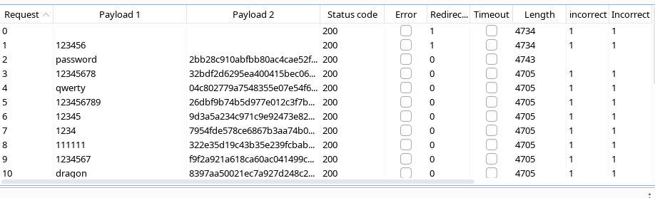

# DVWA - Bruteforce - Medium

## Set Up Burp Suite

Start a new temp project in Burp Suite.

We will be using Burp Suite Browser.

1. Click on Proxy.
2. Under Proxy click Intercept.
3. Now click on Open Browser.
4. Enter the IP Address of the DVWA Virtual Machine.

now you have this site.

## Login

Username: admin

Password: password

## Set up for this challenge

1. Go to DVWA Security.
2. Now Select hard in the drop down menu and submit. You get the following alert. 
3. For confirmation on bottom left side you can check. 
4. Now click on Brute Force.

## Now Lets Start with the attack.

Now in burpsuite, click on ``Intercept is off`` to turn the intercept on.

Try entering the username ``admin`` and password ``pass`` and login.

Now lets send this information to Intruder.

Click on Action then Send to Intruder or Press ``Ctrl + i``.

select pass and click on add.

now we have set pass as the variable.

We now have a user_token that changes every time so the method used in easy and medium will not work. You can try and check it out.

Now lets add the user token as a variable.

Now we are gonna change the attack type to pitchfork as we have 2 variables.

## Setting Up the Payload

Go to Intuder -> Payloads

For the first payload sets

In payload settings, lets load up this [file](https://github.com/danielmiessler/SecLists/blob/master/Passwords/xato-net-10-million-passwords.txt) from SecLists.

Click on load then goto the location of the file and select the file.

After Setup You get this

and for the second payload we will be using recursive grep.

Under Settings -> Grep - Extract click on add.

click on fetch responce.

Set start at offset and end at fixed length.

Give ok.

Set redirections to Always

## Final Step

Go to Intruder -> Settings -> Grep Match

Clear all and add ``incorrect`` and ``Incorrect`` to the list.

Go to resource pool and create a new resource pool with max set as 1.

Now start the attack.

## Results

We can see payload 1 is the passwords and payload 2 is the user token which always changes.

We can see changes in the row 2  in length and incorrect.

So we searched for incorrect passwords so all incorrect passwords are marked 1

the the password for admin user is ``password``.

The only problem faced was, there is a dely of 2 seconds.

Simmilarly there are few other users in the database their passwords are

* admin:password
* 1337:charley
* gordonb:abc123
* Pablo:letmein
* Smithy:password
